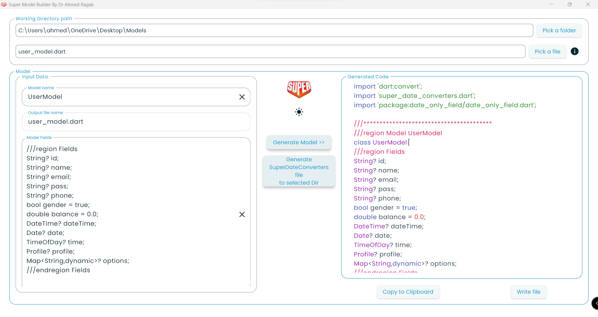
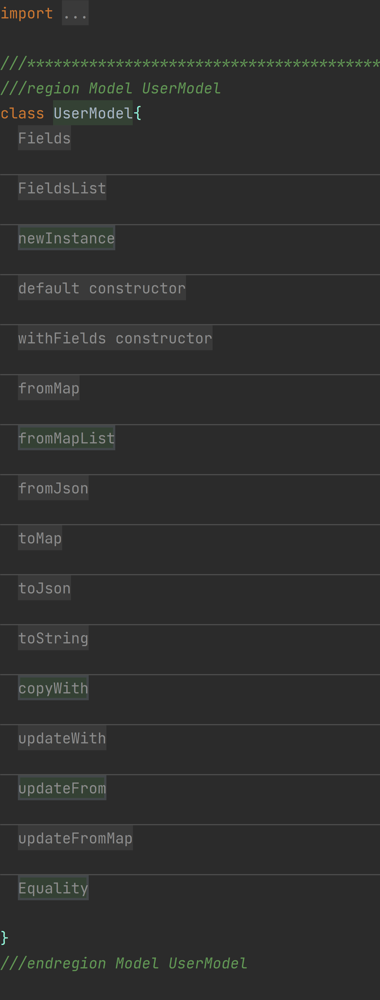

# Flutter_Super_Model_Builder

Flutter super model builder is an easy tool for creating flutter models with all necessary
functions nd utilities to make development process easier and maintainable.

## Getting started


Add to your project yaml dependencies:
```dart
dependencies:
  intl: ^0.17.0
```
Add to your project yaml dependencies if you need date only fields:

https://pub.dev/packages/date_only_field
```dart
dependencies:
  date_only_field: ^0.0.7
```

## Usage

{:target="_blank"}

## The OUTPUT MODEL Layout
{:target="_blank"}

## The OUTPUT MODEL Code
{:target="_blank"}


## Download

Web version:

[https://a7mdragab.github.io/flutter_super_model_builder](Flutter_Super_Model_Builder_Web){:target="_blank"}

Any features needed will be added. Just tell me.
